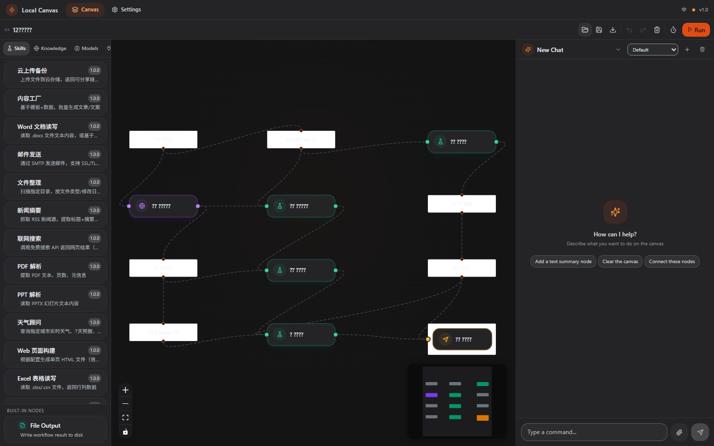

# Local Canvas 鈥?鍙鍖?AI 宸ヤ綔娴佺敾甯?

[](LICENSE) [](package.json)



鎷栨嫿鑺傜偣鍗冲彲鏋勫缓 AI 宸ヤ綔娴併€傚畬鍏ㄦ湰鍦拌繍琛岋紝鏀寔澶氭ā鍨嬪垏鎹€佺煡璇嗗簱 RAG銆丄PI 闆嗘垚鍜屽唴缃?AI 瀵硅瘽銆?

## 鍔熻兘

- **鎷栨嫿寮忕敾甯?* 鈥?鍙鍖栨惌寤?AI 宸ヤ綔娴?
- **澶氭ā鍨嬫敮鎸?* 鈥?OpenAI / Ollama / Anthropic / llama.cpp / 鍐呯疆鏈湴妯″瀷
- **鐭ヨ瘑搴?RAG** 鈥?绱㈠紩鏈湴鏂囨。锛屽寮?AI 涓婁笅鏂?
- **API 闆嗘垚** 鈥?鍦ㄥ伐浣滄祦涓皟鐢ㄥ閮ㄦ湇鍔?
- **鍐呯疆 AI 瀵硅瘽** 鈥?鑷劧璇█鎺у埗鐢诲竷鎿嶄綔
- **Electron 妗岄潰搴旂敤** 鈥?Windows / macOS / Linux 璺ㄥ钩鍙?


## 瀵规爣鏈湴鎵ｅ瓙

| 缁村害 | Local Canvas | 鏈湴鎵ｅ瓙 (Coze) |
|------|:-----------:|:---------------:|
| 杩愯鏂瑰紡 | 瀹屽叏鏈湴锛屾棤闇€鑱旂綉 | 渚濊禆浜戠鏈嶅姟 |
| 妯″瀷鏀寔 | 鍐呯疆 + OpenAI/Ollama/Anthropic/llama.cpp | 浠呴檺鎵ｅ瓙骞冲彴妯″瀷 |
| 宸ヤ綔娴?| 鍙鍖栨嫋鎷斤紝鑷敱杩炵嚎 | 棰勮妯℃澘锛岀伒娲诲害鍙楅檺 |
| 鐭ヨ瘑搴?| 鏈湴鏂囨。 RAG锛岄殣绉佸畨鍏?| 闇€涓婁紶鍒颁簯绔?|
| 鏁版嵁闅愮 | 100% 鏈湴锛屾暟鎹笉鍑烘湰鏈?| 鏁版嵁瀛樺偍鍦ㄦ墸瀛愭湇鍔″櫒 |
| 鎴愭湰 | 鍏嶈垂锛屾棤 API 璋冪敤璐圭敤 | 鏈夎皟鐢ㄩ噺闄愬埗鍜屾敹璐?|
| 鍐呯疆妯″瀷 | Qwen2.5-3B 寮€绠卞嵆鐢?| 鏃犲唴缃紝闇€鑱旂綉璋冪敤 |
| 鎵╁睍鎬?| 鑷畾涔?Skill 鑴氭湰 (Python/Node/Shell) | 浠呭钩鍙板唴鎻掍欢 |
| 閫傜敤浜虹兢 | 閲嶈闅愮銆佺绾垮満鏅€佸紑鍙戣€?| 蹇€熶笂鎵嬨€佷簯绔崗浣?|

## 瀹夎鏂瑰紡

### 鏂瑰紡涓€锛氫綔涓?Codex 鎻掍欢瀹夎

鍦?Codex 渚ц竟鏍?鈫?鎻掍欢甯傚満 鈫?鎼滅储 "Local Canvas" 鈫?鐐瑰嚮瀹夎銆?

鎴栬€呮墜鍔ㄥ厠闅嗭細

```bash
git clone https://github.com/1148194155-cell/bureau2.git
```

### 鏂瑰紡浜岋細浣滀负 OpenAI 鍏煎 Skill 浣跨敤

灏?`local-canvas/` 鐩綍鏀惧叆浠绘剰 OpenAI agent 鐨?skills 璺緞涓嬪嵆鍙嚜鍔ㄥ彂鐜般€?

### 鏂瑰紡涓夛細鐙珛杩愯

```bash
node -v  # 闇€瑕?Node.js >= 18
cd local-canvas/scripts
npm install
cd renderer
npm install
cd ..
node src/index.js    # 鍚庣 http://localhost:3001
npx vite --cwd renderer  # 鍓嶇 http://localhost:5173
```

## 蹇€熷紑濮?

```powershell
.\local-canvas\scripts\start.ps1           # 鍚姩鍓嶅悗绔?
.\local-canvas\scripts\start.ps1 -NoBrowser # 涓嶈嚜鍔ㄦ墦寮€娴忚鍣?
.\local-canvas\scripts\stop.ps1            # 鍋滄鏈嶅姟
```

鍚姩鍚庤闂細
- 鍓嶇鐣岄潰锛歨ttp://localhost:5173
- 鍚庣 API锛歨ttp://localhost:3001/api
- 鍋ュ悍妫€鏌ワ細http://localhost:3001/api/health

## 椤圭洰缁撴瀯

```
local-canvas/
鈹溾攢鈹€ skills/SKILL.md          # AI skill 鎸囦护
鈹溾攢鈹€ agents/openai.yaml       # OpenAI agent 鍏冩暟鎹?
鈹溾攢鈹€ .codex-plugin/plugin.json # Codex 鎻掍欢娓呭崟
鈹溾攢鈹€ scripts/
鈹?  鈹溾攢鈹€ src/                 # 鍚庣 (Express + SQLite + WebSocket)
鈹?  鈹溾攢鈹€ renderer/            # 鍓嶇 (React + Vite + React Flow)
鈹?  鈹溾攢鈹€ start.ps1            # 涓€閿惎鍔?(Windows)
鈹?  鈹斺攢鈹€ stop.ps1             # 鍋滄鏈嶅姟
鈹斺攢鈹€ assets/                  # 璧勬簮鏂囦欢
```

## 璁稿彲璇?

[MIT](LICENSE)

---

# Local Canvas 鈥?Visual AI Workflow Canvas

Drag and drop nodes to build AI workflows. Fully local execution, multi-model support, knowledge base RAG, API integration, and built-in AI assistant.

## Features

- **Drag-and-drop Canvas** 鈥?Visually build AI workflows
- **Multi-model Support** 鈥?OpenAI / Ollama / Anthropic / llama.cpp / built鈥慽n local model
- **Knowledge Base RAG** 鈥?Index local documents to enhance AI context
- **API Integration** 鈥?Call external services within workflows
- **Built-in AI Chat** 鈥?Natural language control over canvas operations
- **Electron Desktop App** 鈥?Cross鈥憄latform for Windows / macOS / Linux

## Quick Start

Double-click `start.bat` (or `鍚姩.bat`) 鈥?dependency installation and service startup handled automatically.

Or via PowerShell:

```powershell
.\local-canvas\scripts\start.ps1
```

Then visit:
- Frontend: http://localhost:5173
- Backend API: http://localhost:3001/api

## vs Local Coze

| Dimension | Local Canvas | Coze (Local) |
|-----------|:-----------:|:------------:|
| Runtime | Fully local, no internet | Cloud-dependent |
| Models | Built-in + OpenAI/Ollama/Anthropic/llama.cpp | Coze platform only |
| Workflow | Drag-and-drop, free connection | Preset templates, limited |
| Knowledge Base | Local RAG, privacy safe | Upload to cloud |
| Data Privacy | 100% local | Stored on Coze servers |
| Cost | Free, no API fees | Usage limits & charges |
| Built-in Model | Qwen2.5-3B ready | None, needs internet |
| Extensibility | Custom Skill scripts (Python/Node/Shell) | Platform plugins only |
| Target Users | Privacy-focused, offline, developers | Quick start, cloud collab |

## License

[MIT](LICENSE)
