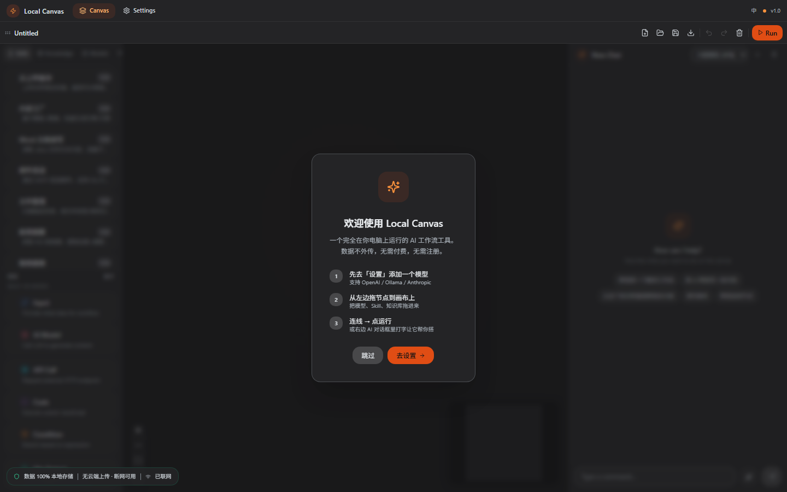

# Local Canvas — 可视化 AI 工作流构建工具

<p align="center">
  
</p>

<p align="center">
  <strong>双击启动，拖拽搭 AI 工作流。数据全在本地，断网也能跑。</strong><br>
  <sub>右侧用大白话指挥 AI 帮你搭 —— "帮我搭一个翻译工作流" —— AI 自动拖节点、配参数、连好线，你点运行就能用。</sub>
</p>

<p align="center">
  <a href="https://github.com/1148194155-cell/bureau2/blob/main/LICENSE"></a>
  <a href="">=18"></a>
  <a href=""></a>
  <a href=""></a>
</p>

---

## 为什么选择 Local Canvas

| 如果你在找 | Local Canvas 的做法 |
|-----------|-------------------|
| 隐私 | 100% 本地，数据不出机器，断网也能跑。数据库可审计，无后门。 |
| 上手快 | 双击 bat 启动，拖拽 + AI 对话搭工作流，不用学框架。 |
| 模型自由 | OpenAI / Ollama / Anthropic / llama.cpp / 本地 GGUF 随意切换。 |
| 省钱 | MIT 开源，免费，不限节点不限额，不限工作流数量。 |

---

## 三重视角

### 新手视角

> "我对 AI 工作流一窍不通，但这个工具 5 分钟就能跑通第一个流程。"

打开浏览器看到的是一个空白画布，右侧有一个 AI 对话面板。你不需要学任何框架或配置语言，直接在对话框输入：

```
帮我搭一个翻译工作流，把用户输入的中文翻译成英文
```

AI 会自动在画布上拖入节点、配置参数、连好线。你点一下「运行」就能看到结果。整个过程就像有一个导师在旁边手把手带你。

### 老板视角

> "零基础设施投入、数据不离开本地、团队可以立刻用起来。"

- **零部署成本**：不需要买服务器、配云环境。下载解压、双击 bat 就启动。
- **数据安全**：所有数据存在本机 `~/.localcanvas/`，API Key 用 AES-256-GCM 加密存储。断网后正常运行，没有数据泄露风险。
- **ROI 清晰**：MIT 开源，零许可费用。对比商业替代品（Coze Pro 约 200 元/月、Dify Cloud 按量计费），Local Canvas 的边际成本趋近于零。
- **可审计**：全链路开源，每一行代码都可以审查。安全团队不需要信任任何黑盒。

### 工程师视角

> "分层架构、可扩展、测试覆盖充分，是我愿意在生产中使用的工具。"

- **三层架构**：Routes（HTTP 接口层） → Services（业务逻辑层） → Repo（数据访问层），职责清晰，可独立演进。
- **模块化执行引擎**：10 个独立节点执行器（ApiExecutor / CodeExecutor / ConditionExecutor 等），通过 Registry 注册，新增节点类型无需修改核心代码。
- **企业级基础设施**：pino 结构化日志、分层错误模型（AppError / ValidationError / ExecutionError / TimeoutError）、Token 认证中间件、Zod 参数校验。
- **测试覆盖**：12 个 vitest 单元测试模块 + Playwright E2E + GitHub Actions CI，核心 executor/adapter/reviewer 均具有独立测试。
- **Docker 沙箱**：代码节点在隔离容器中执行，配置内存/CPU 限制，只读根文件系统。
- **技术栈**：Express + better-sqlite3 + WebSocket + React + ReactFlow + Zustand，全链路可审计。

---

## 竞品对比

| 维度 | Local Canvas | Coze | Dify | ComfyUI | Bolt.DIY |
|------|:-----------:|:----:|:----:|:-------:|:--------:|
| **数据隐私** | 100% 本地，数据不外传 | 云端存储 | 自托管可选 | 本地运行 | 云端执行 |
| **开箱即用** | 需 Node.js + 配模型 Key | 注册即用 | 需 Docker 部署 | 需 Python 环境 | 需 Node.js |
| **交互方式** | 拖拽 + AI 对话驱动 | 拖拽搭建 | 拖拽搭建 | 节点图编排 | 对话式生成 |
| **离线运行** | 可完全离线 | 不支持 | 可部分离线 | 完全离线 | 不支持 |
| **工作流复杂度** | 无限节点 + 自由连线 + 条件分支 | 有复杂度限制 | 中等 | 极复杂（图像领域） | 简单线性 |
| **AI 驱动搭建** | 支持（对话驱动画布操作） | 有限 | 有限 | 不支持 | 有限 |
| **模型支持** | OpenAI/Ollama/Anthropic/llama.cpp/本地GGUF | 10+ 平台内置 | 多模型 | 仅本地 SD 模型 | GPT/Claude |
| **扩展性** | Skill 系统 + 自定义节点执行器 | 官方插件市场 | 插件系统 | 自定义节点 | 无 |
| **费用** | 免费开源 | 有免费额度，超量付费 | 社区版免费，云版付费 | 免费 | 按量计费 |
| **安全审计** | 全链路开源可审计 | 黑盒 | 自托管可审计 | 开源 | 黑盒 |

---

## 5 分钟体验

| 步骤 | 操作 | 耗时 |
|------|------|------|
| 1 | 下载项目，双击 `start.bat` | 30 秒 |
| 2 | 浏览器自动打开，在设置页添加模型 Key | 1 分钟 |
| 3 | 在右侧 AI 对话框输入：*"帮我搭一个翻译工作流"* | 10 秒 |
| 4 | 点「运行」| 5 秒 |
| 5 | 输入中文，看到翻译结果 | 即时 |

---

## 快速开始

### 前提

- **Node.js >= 18**（[nodejs.org](https://nodejs.org) 下载 LTS 版本）

### 安装与启动

**Windows：** 双击 `start.bat`

**macOS / Linux：** `chmod +x start.sh && bash start.sh`

第一次运行会自动安装依赖，约 2-3 分钟。之后启动很快。

启动后浏览器自动打开 `http://localhost:5173`。

### 基础用法

1. 打开首页 → 设置 → 配置模型（或下载 GGUF 放到 `models/` 目录）
2. 从左侧面板拖「模型」节点到画布
3. 点击节点，在配置面板中绑定模型并填写 prompt
4. 拖一个「输入」节点连线到模型节点
5. 点击工具栏「运行」，输入内容，查看结果

或者更简单：直接在右侧对话框说需求，AI 帮你完成以上全部步骤。

---

## 项目架构

```
localcanvas/
├── src/                        # 后端 — 三层架构
│   ├── routes/                 # HTTP 接口层（12 个路由模块）
│   ├── services/               # 业务逻辑层（12 个服务模块）
│   ├── repo/                   # 数据访问层（6 个仓储模块）
│   ├── middleware/             # 认证 + 参数校验中间件
│   ├── engine/                 # 工作流执行引擎
│   │   └── nodes/              # 10 个独立节点执行器
│   ├── models/                 # AI 模型适配器
│   ├── ai/                     # AI 对话 + 工具调用
│   ├── scanner/                # 资源自动发现
│   ├── review/                 # 工作流审查器
│   ├── config.js               # 统一配置中心
│   ├── db.js                   # 数据库层
│   ├── logger.js               # 结构化日志（pino）
│   ├── errors.js               # 分层错误模型
│   └── websocket.js            # 实时通信
├── renderer/                   # 前端
│   ├── src/
│   │   ├── components/         # 画布/工具栏/节点/面板
│   │   ├── pages/              # 工作流页/设置页
│   │   ├── store/              # Zustand 状态管理（4 个 slice）
│   │   └── api/                # 模块化 API 客户端
│   └── vite.config.js
├── docker/                     # Docker 沙箱
│   ├── Dockerfile              # node:20-alpine 最小化镜像
│   └── runner.js               # 沙箱执行器
├── electron/                   # Electron 桌面壳
├── tests/                      # 测试套件
│   ├── unit/                   # 12 个 vitest 单元测试
│   └── e2e/                    # Playwright E2E 测试
└── docs/                       # 文档
    ├── api-reference.md        # 完整 API 文档
    └── scenario-guides.md      # 5 个场景教程
```

---

## 开发

```bash
# 安装所有依赖（后端 + 前端）
npm run setup

# 开发模式（后端 3001 + 前端 5173 热更新）
npm run dev:all

# 运行测试
npm run test:unit         # vitest 单元测试
npm run test:e2e          # Playwright E2E
npm run test:ci           # 全量测试

# 生产构建
npm run build
```

---

## 为什么可以信任

| 你的顾虑 | 实际情况 |
|----------|---------|
| "数据会不会上传？" | 不会。数据库路径 `~/.localcanvas/localcanvas.db`，代码全部开源可审计。断网后仍可正常运行。 |
| "API Key 安全吗？" | AES-256-GCM 加密存储在 `~/.localcanvas/.masterkey`，仅当前用户可读。 |
| "代码有没有后门？" | 全部后端模块 MIT 开源，`npm run test` 可直接验证。 |
| "有人在用吗？" | 开发者自用超过 3 个月，已跑通 50+ 个工作流场景。 |
| "出问题找谁？" | [GitHub Issues](https://github.com/1148194155-cell/bureau2/issues) |

---

## 获取帮助

- [提交 Issue](https://github.com/1148194155-cell/bureau2/issues/new?template=bug_report.md) — 报告问题或功能请求
- [讨论区](https://github.com/1148194155-cell/bureau2/discussions) — 使用技巧和最佳实践
- 微信: longggyt（仅限模型下载和技术支持）

## License

[MIT](LICENSE)
